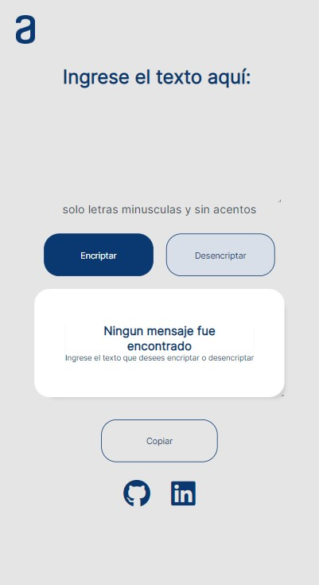
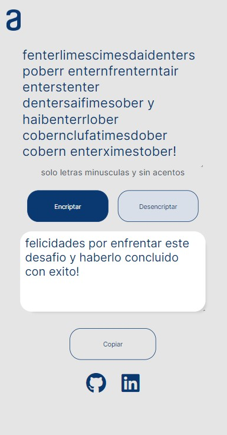
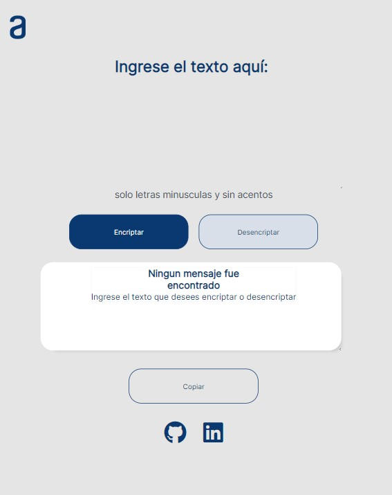
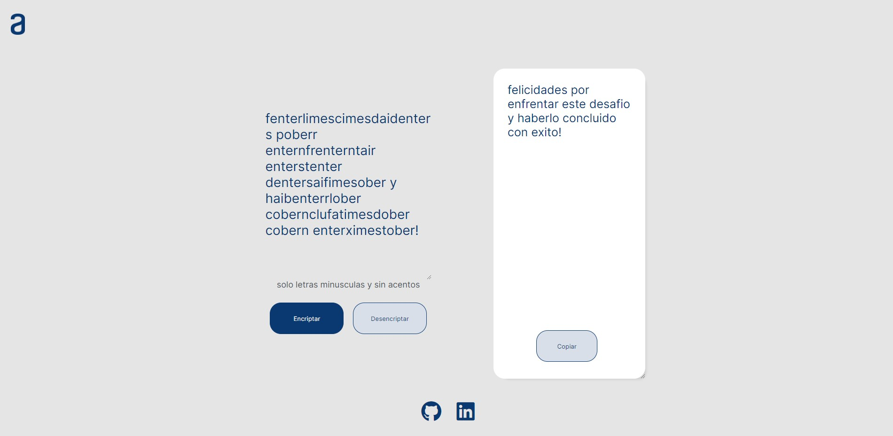

# Encriptador

Este proyecto es un encriptador y desencriptador de mensajes. Permite ingresar un mensaje y encriptarlo utilizando un algoritmo personalizado. Luego, el mensaje encriptado se puede desencriptar para recuperar el mensaje original.

El proyecto es completamente responsive, lo que significa que se adapta automáticamente a diferentes tamaños de pantalla, desde dispositivos móviles hasta pantallas más grandes.

## Demo

Puedes ver una demostración del proyecto en el siguiente enlace:

[Encriptador Demo](https://villalbaleandro.github.io/encriptador/)

## Tecnologías utilizadas

El proyecto está desarrollado utilizando las siguientes tecnologías:

- HTML
- CSS
- JavaScript

## Instrucciones de uso

1. Ingresa el mensaje que deseas encriptar en el campo de texto proporcionado.
2. Haz clic en el botón "Encriptar" para encriptar el mensaje.
3. El mensaje encriptado se mostrará en el área de texto.
4. Para desencriptar el mensaje, haz clic en el botón "Desencriptar".
5. El mensaje original se mostrará nuevamente en el área de texto.

## Capturas de pantalla

Aquí tienes algunas capturas de pantalla del proyecto:

## Contribuciones

Las contribuciones son bienvenidas. Si deseas realizar mejoras o correcciones en el proyecto, puedes enviar tus propuestas mediante pull requests.

